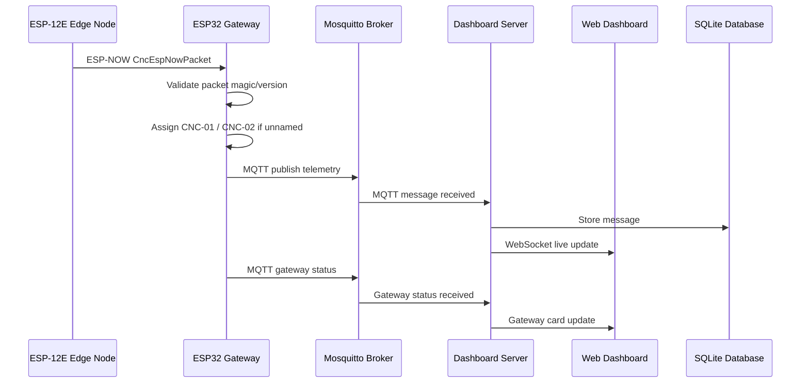

# Data Flow Diagram


```mermaid
sequenceDiagram
    participant E as ESP-12E Edge Node
    participant G as ESP32 Gateway
    participant B as Mosquitto Broker
    participant S as Dashboard Server
    participant D as Web Dashboard
    participant DB as SQLite Database

    E->>G: ESP-NOW CncEspNowPacket
    G->>G: Validate packet magic/version
    G->>G: Assign CNC-01 / CNC-02 if unnamed
    G->>B: MQTT publish telemetry
    B->>S: MQTT message received
    S->>DB: Store message
    S->>D: WebSocket live update
    G->>B: MQTT gateway status
    B->>S: Gateway status received
    S->>D: Gateway card update
```

## MQTT Topics

```text
factory/cnc/<machine_id>/telemetry
factory/gateway/ESP32-GW-01/status
```
