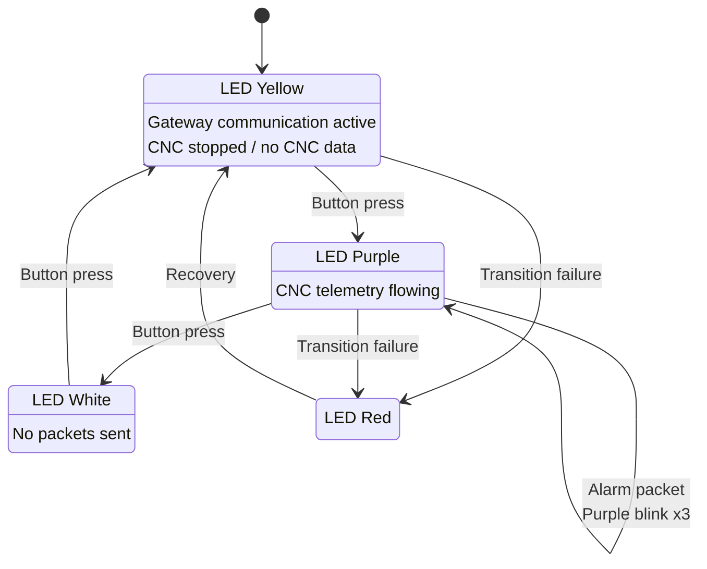

# ESP-12E Button State Machine

## LED Color Mapping

| State / Event | LED Color |
|--------------|-----------|
| LIVE_IDLE | Yellow |
| RUNNING | Purple |
| OFFLINE_STANDBY | White |
| TRANSITION_ERROR | Red |
| Alarm packet during RUNNING | Purple blink x3 |
