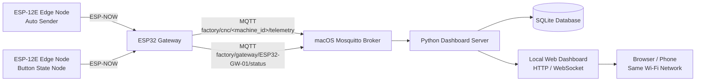

# System Architecture Diagram

## Notes

- ESP-12E nodes send compact ESP-NOW packets.
- ESP32 acts as a gateway and converts ESP-NOW packets into MQTT JSON messages.
- macOS runs the Mosquitto broker, dashboard server, database, and web UI.
- The dashboard shows both gateway status and CNC device status.
